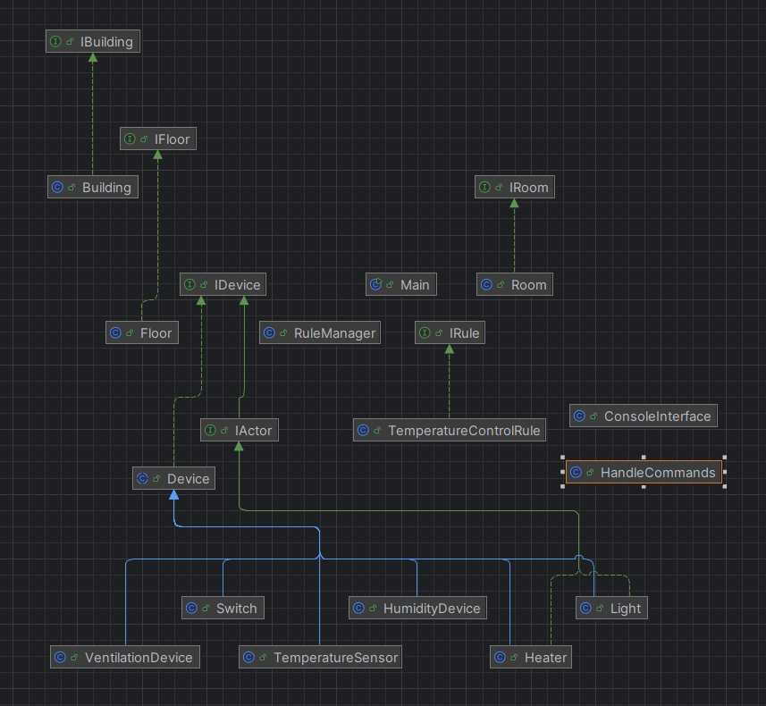

### Überblick über das Smart Home System
Dieses Dokument dient als umfassender Leitfaden für das im Rahmen meines Studiums entwickelte Smart Home System an der FHDW. Es zielt darauf ab, eine detaillierte Einsicht in die Struktur und Funktionalität des Systems zu bieten, sowie die technologischen Entscheidungen, die zur Realisierung des Projekts getroffen wurden, zu erläutern.

### Zielsetzung dieser Dokumentation
Der Hauptzweck dieses Dokuments ist es, eine klare und präzise Darstellung der Architektur des Smart Home Systems zu liefern. Es wird beschrieben, wie die einzelnen Komponenten und Module interagieren, um eine anpassungsfähige und erweiterbare Plattform für die Gebäudesteuerung zu schaffen. Weiterhin erörtere ich die Verbindungspunkte zwischen den Systemmodulen sowie die Einbindung und Erweiterungsmöglichkeiten, die das System bietet.

### Entstehungshintergrund des Smart Home Systems
Das System wurde entwickelt, um innovative Technologien in der Gebäudeautomation praktisch anzuwenden und das Lehrangebot mit realen, technischen Herausforderungen zu bereichern. Als einzelner studentischer Entwickler war es meine Aufgabe, einen funktionierenden Prototyp eines umfassenden Smart Home Systems zu erstellen, das als Basis für die Automatisierung verschiedener Gebäudefunktionen dient und die Integration zusätzlicher Komponenten erleichtert.

Die Hauptmerkmale des Systems umfassen die Bereitstellung einer Betriebsumgebung für die Gebäudeautomatisierung, die einfache Einführung neuer Sensoren und Aktoren und die effiziente Verknüpfung mit externen Systemen.

### Definition der Systemgrenzen
Innerhalb dieser Dokumentation werden die Schnittstellen und Interaktionspartner des Smart Home Systems klar abgegrenzt. Dies bezieht sich auf die Verbindungen zu Sensoren und Aktoren sowie auf die Nutzerschnittstellen durch das Command Line Interface. Diese Grenzen sind so gesetzt, dass sie die Flexibilität des Systems erhalten und gleichzeitig eine einfache Skalierbarkeit und Anpassungsfähigkeit ermöglichen.

### Fachlicher Kontext
Der fachliche Kontext des Smart Home Systems beinhaltet die Interaktionen innerhalb des Systems, das ausschließlich mit simulierten Daten und internen Steuerungslogiken arbeitet.

### Externe Kommunikationspartner
Das System nutzt keine realen externen Geräte oder Sensoren. Stattdessen verwendet es simulierte Schnittstellen, die wie folgt funktionieren:

#### Dummy-Sensoren und Aktoren: 
Das System generiert selbst Daten von simulierten Sensoren wie Temperaturfühlern, Lichtsensoren und Bewegungsdetektoren. Diese Daten werden verwendet, um Steuerbefehle an simulierte Aktoren wie Heizungen, Lichter und Türschlösser zu senden.
#### Visualisierungsinterface: 
Alle Interaktionen mit dem Nutzer erfolgen über ein einfaches Command Line Interface, das den simulierten Zustand des Systems visualisiert und Nutzerbefehle für Testszenarien entgegennimmt.

### Fachliche Schnittstellen
Die fachlichen Schnittstellen des simulierten Systems umfassen:

#### Nutzereingabe: 
Über das Terminal können Nutzer Befehle eingeben, die normalerweise die Aktoren steuern oder Informationen über die Zustände der Sensoren liefern würden.
#### Systemausgabe: 
Simulierte Antworten und Zustände des Systems werden textbasiert über das Terminal ausgegeben.
#### Simulierte Steuerbefehle und Sensorabfragen: 
Das System verwendet ein internes Regelwerk, um basierend auf simulierten Sensorwerten automatisierte Aktionen zu steuern oder auf Nutzereingaben zu reagieren.

### Technischer Kontext
Der technische Kontext beschreibt die internen technischen Verbindungen und Schnittstellen des Systems, die ausschließlich mit simulierten Daten arbeiten.

### Technische Schnittstellen
Die technischen Schnittstellen des Smart Home Systems umfassen:

#### Terminal: 
Das Terminal dient als primäre Schnittstelle für den Endnutzer, um mit dem simulierten System zu interagieren.
#### Interne Logikverbindungen: 
Das System interagiert intern mit simulierten Netzwerkverbindungen, die es ermöglichen, Daten zwischen den simulierten Sensoren und Aktoren auszutauschen.
#### Datenverarbeitungslogik: 
Die Entscheidungsfindung basiert auf einer Reihe von definierten Regeln, die simulieren, wie das System auf Änderungen in den simulierten Sensorwerten reagieren würde.

### Kontextdiagramm

Das Kontextdiagramm visualisiert die Interaktionen und Datenflüsse innerhalb des Smart Home Systems, das ausschließlich mit simulierten Komponenten arbeitet. Folgende Hauptkomponenten und ihre Verbindungen sind dargestellt:

#### Mensch (Nutzer):
**Position:** Links neben der CLI (Command Line Interface).
**Beschreibung:** Der Nutzer repräsentiert die Person, die Interaktionen mit dem System über die CLI durchführt. Diese Darstellung symbolisiert die Schnittstelle, über welche Nutzereingaben erfolgen und Informationen vom System empfangen werden.
#### Command Line Interface (CLI):
**Position:** Zentral im unteren Bereich des Diagramms, direkt verbunden mit dem Menschen (Nutzer) und der internen Steuerungslogik.
**Beschreibung:** Das CLI ist die primäre Benutzerschnittstelle, über die der Nutzer Befehle eingibt und Rückmeldungen vom System erhält. Es dient als Vermittler zwischen dem Menschen und der Steuerungslogik des Smart Home Systems.
#### Smart Home System:
**Position:** Umfasst die zentrale und obere Bereiche des Diagramms.
**Beschreibung:** Innerhalb dieser Systemgrenze befinden sich die simulierten Sensoren, Aktoren, die Steuerungslogik und die Datenverarbeitung. Das gesamte System interagiert intern, um eine simulierte Gebäudeautomation zu realisieren.
#### Dummy-Sensoren:
**Position:** Innerhalb der Systemgrenze, meist im oberen Bereich.
**Beschreibung:** Diese Komponenten simulieren verschiedene Arten von Sensordaten (wie Temperatur, Licht, Bewegung), die zur Steuerungslogik gesendet werden.
#### Simulierte Aktoren:
**Position:** Ebenfalls innerhalb der Systemgrenze, nahe den Sensoren.
**Beschreibung:** Aktoren reagieren auf Befehle von der Steuerungslogik, um simulierte Aktionen wie Lichtsteuerung oder Temperaturanpassungen durchzuführen.
#### Steuerungslogik:
**Position:** Im Zentrum der Systemgrenze, direkt verbunden mit Sensoren, Aktoren und dem CLI.
**Beschreibung:** Diese Kernkomponente verarbeitet alle Eingaben von Sensoren und der CLI, trifft Entscheidungen und sendet entsprechende Befehle an die Aktoren. Sie ist das Gehirn des Systems.
#### Datenverarbeitung:
**Position:** In der Nähe der Steuerungslogik innerhalb der Systemgrenze.
**Beschreibung:** Diese Komponente handhabt interne Datenoperationen, speichert Testergebnisse und Verlaufsinformationen, die für Testszenarien innerhalb des simulierten Systems benötigt werden.

## 3. Anforderungsanalyse
### 3.1 Funktionale Anforderungen
Das Smart Home System, das für die FHDW entwickelt wird, zielt darauf ab, eine Plattform für Lehr- und Forschungszwecke zu bieten. Daher muss das System folgende funktionale Anforderungen erfüllen:

#### Aktoren und Sensoren Integration: 
Das System muss verschiedene Aktoren und Sensoren integrieren können. Beispiele für Aktoren sind Lichtschalter, Relais, Lüftungsregler, Heizungen, Rolladenmotoren und Türschlösser. Sensoren sollten in der Lage sein, verschiedene Umgebungsparameter wie Temperatur, Lichtstärke, Luftfeuchtigkeit, Anwesenheit von Personen und RFID-Tags zu erfassen.
#### Visualisierung: 
Eine grundlegende Visualisierungskomponente muss implementiert werden, die über ein Command Line Interface (CLI) bedienbar ist. Diese Komponente sollte die Möglichkeit bieten, eine Liste von Gebäuden, Etagen und Räumen anzuzeigen sowie aktuelle Sensorwerte pro Raum oder Sensortyp darzustellen.
#### Manuelle Ansteuerung von Aktoren: 
Benutzer sollten in der Lage sein, Aktoren manuell zu steuern, sowohl auf der Ebene einzelner Räume als auch gebäude- oder etagenweit.
#### Regelsystem: 
Es sollte möglich sein, Regeln zu definieren, die auf Klassen oder Interfaces basieren. Diese Regeln können entweder durch Sensorereignisse, zu festgelegten Zeiten oder manuell getriggert werden.
#### Einfache Erweiterbarkeit: 
Die Softwarearchitektur muss so gestaltet sein, dass sie einfach um neue Sensoren, Aktoren und Regeln erweitert werden kann.
### 3.2 Nicht-funktionale Anforderungen
Neben den funktionalen Anforderungen muss das Smart Home System auch folgende nicht-funktionale Anforderungen erfüllen:

#### Skalierbarkeit: 
Das System muss in der Lage sein, mehrere Gebäude zu unterstützen und leicht skalierbar sein, um zusätzliche Gebäude, Etagen und Räume hinzufügen zu können.
#### Benutzerfreundlichkeit: 
Die Bedienung des Systems, insbesondere das CLI, muss intuitiv und benutzerfreundlich sein, um eine effiziente Nutzung und Forschung zu ermöglichen.
#### Zuverlässigkeit und Stabilität: 
Das System muss stabil und zuverlässig laufen, insbesondere da es für Bildungs- und Forschungszwecke eingesetzt wird.
#### Wartbarkeit: 
Die Wartung des Systems sollte durch klare Dokumentation und eine modular aufgebaute Architektur vereinfacht werden

### 3.3 Benutzerrollen und Interaktionen
Im Rahmen des Entwurfs für das Smart Home System an der FHDW wird kein Unterschied zwischen verschiedenen Benutzertypen gemacht. Das System ist so konzipiert, dass es keine spezifischen Rollen mit unterschiedlichen Anforderungen oder Berechtigungen gibt. Jeder Benutzer des Systems hat Zugriff auf die gleichen Funktionen und Möglichkeiten:

#### Einheitliche Benutzerinteraktion: 
Alle Benutzer des Systems interagieren über das gleiche Command Line Interface (CLI) und haben Zugriff auf alle Funktionen des Systems. Dies umfasst die Anzeige von Gebäuden, Etagen und Räumen, das Abrufen aktueller Sensorwerte und die manuelle Ansteuerung von Aktoren.
#### Gleiche Zugriffsrechte: 
Es gibt keine differenzierten Zugriffsrechte oder unterschiedliche Benutzerebenen. Jeder Benutzer kann das System vollumfänglich nutzen, was die Bedienung vereinfacht und die Einarbeitungszeit minimiert.
#### Homogene Nutzungserfahrung: 
Die Entscheidung, keine unterschiedlichen Benutzerrollen zu implementieren, zielt darauf ab, eine homogene Nutzungserfahrung für alle Anwender zu schaffen. Dies ist besonders vorteilhaft in einem akademischen Umfeld, wo Flexibilität und einfacher Zugang zu Lehr- und Forschungstools gewünscht sind.

## 4. Design und Konzeption
   Das Design und die Konzeption des Smart Home Systems an der FHDW basieren auf einer durchdachten und skalierbaren Softwarearchitektur, die darauf abzielt, eine flexible Plattform für Lehr- und Forschungszwecke zu bieten. Dieser Abschnitt der Dokumentation beschreibt die zentralen Designentscheidungen, die Bausteinsicht und das UML-Diagramm, das die Systemarchitektur visualisiert.

### 4.1 Bausteinsicht
Die Bausteinsicht des Smart Home Systems visualisiert die wichtigsten Softwarekomponenten und ihre Beziehungen zueinander. Hier wird die Hierarchie und Kommunikation zwischen verschiedenen Elementen des Systems dargestellt, die in der Systemarchitektur definiert sind.

#### Hauptkomponenten und ihre Funktionen
**IBuilding, IFloor, IRoom:** Diese Schnittstellen definieren die grundlegenden Eigenschaften und Methoden für Gebäude, Etagen und Räume. Sie ermöglichen eine abstrakte Interaktion mit den physischen Strukturen innerhalb des Systems.

**Building, Floor, Room:** Konkrete Implementierungen der IBuilding, IFloor und IRoom Schnittstellen. Diese Klassen sind verantwortlich für die Verwaltung der spezifischen Daten und Verhaltensweisen ihrer jeweiligen physischen Gegenstücke.

**IDevice, IActor:** Schnittstellen, die das Verhalten von Geräten und Aktoren im System definieren. IDevice bietet eine generelle Abstraktion für Geräte, während IActor speziell für Aktoren wie Lichtschalter oder Heizungen verwendet wird.

**Device, Actor:** Konkrete Implementierungen der IDevice und IActor Schnittstellen. Device dient als Basis für spezifischere Geräte, während Actor spezifische Funktionen für die Steuerung und Verwaltung von Aktoren bereitstellt.
**RuleManager:** Eine zentrale Komponente, die für das Management der Regeln im System zuständig ist. Sie koordiniert die Ausführung von Regeln basierend auf den von Sensoren gelieferten Daten oder anderen Ereignissen.
**IRule:** Eine Schnittstelle, die das erforderliche Verhalten für Regeln im System definiert. Regeln können auf Basis von Sensorwerten, zeitlichen Bedingungen oder manuellen Auslösern aktiviert werden.
**TemperatureControlRule**: Eine konkrete Implementierung der IRule-Schnittstelle, speziell entwickelt zur Temperaturkontrolle innerhalb des Systems. Diese Regel nutzt Daten von Temperatursensoren zur Steuerung von Heizungen oder Klimaanlagen.
**ConsoleInterface:** Die Benutzerschnittstelle des Systems, implementiert als Command Line Interface. Diese Komponente ermöglicht die direkte Interaktion mit dem System durch Befehlseingaben, um Gebäude, Etagen oder Räume zu verwalten und Geräte zu steuern.
**HandleCommands:** Eine Hilfsklasse, die für das Verarbeiten von Benutzerbefehlen über das ConsoleInterface verantwortlich ist. Sie interpretiert die Eingaben und leitet entsprechende Aktionen ein.

#### Spezifische Geräteklassen
Switch, VentilationDevice, TemperatureSensor, HumidityDevice, Light, Heater: Diese Klassen sind spezialisierte Implementierungen von Device oder Actor, die jeweils spezifische Funktionen in Bezug auf ihre Aufgabe im System erfüllen. Beispielsweise kann ein Switch das Ein- und Ausschalten von Licht regeln, während ein TemperatureSensor Temperaturdaten liefert.
Diese Bausteinsicht bietet einen umfassenden Überblick über die Architektur und die einzelnen Komponenten des Smart Home Systems, die für die Erfüllung der spezifischen Anforderungen des Projekts essentiell sind. Sie verdeutlicht, wie die Komponenten miteinander interagieren und zusammenarbeiten, um eine flexible und erweiterbare Plattform für das Smart Home zu schaffen.

Modularität und Wiederverwendbarkeit: Die Verwendung von Schnittstellen wie IBuilding, IFloor, IRoom, IDevice und IActor fördert die Wiederverwendbarkeit von Code und erleichtert die Erweiterung des Systems. Neue Gerätetypen oder Aktoren können durch das Implementieren der entsprechenden Schnittstellen leicht hinzugefügt werden.
Zentrale Verwaltung durch RuleManager: Der RuleManager spielt eine zentrale Rolle im System, indem er die Regeln verwaltet und deren Ausführung steuert. Diese zentrale Steuerung ermöglicht es, dass Regeln systemweit konsistent und effizient angewendet werden.
Interaktion durch ConsoleInterface: Das ConsoleInterface ermöglicht eine direkte und einfache Interaktion mit dem System, was besonders nützlich ist, um das System für Lehr- und Forschungszwecke anzupassen und zu steuern.
Diese Architektur bietet eine klare Trennung der Verantwortlichkeiten und fördert eine hohe Kohäsion innerhalb der Komponenten, was die Wartung und Erweiterung des Systems erleichtert.

### 4.2 UML-Diagramm
(UML-Diagramm hier einfügen)

Das UML-Diagramm bietet eine detaillierte visuelle Darstellung der Beziehungen und Abhängigkeiten zwischen den verschiedenen Komponenten und Klassen des Systems. Es verdeutlicht, wie Daten und Kontrolle durch das System fließen und illustriert die Verbindungen zwischen den einzelnen Modulen.

Beschreibung des UML-Diagramms: (Hier eine detaillierte Beschreibung des UML-Diagramms einfügen, die die Beziehungen zwischen den Klassen, die Vererbungshierarchien und die Nutzung von Schnittstellen beschreibt. Besonders wichtig ist es, auf die Interaktionen zwischen den Klassen im Kontext von Ereignissen und Datenflüssen einzugehen.)

### 4.3 Technologische Wahl
Die Wahl der Technologie für das Smart Home System basiert auf Java, einer robusten und weit verbreiteten Programmiersprache, die sich ideal für die Entwicklung komplexer Softwaresysteme eignet. Java wurde aufgrund seiner starken Objektorientierung, der guten Unterstützung durch Entwicklungswerkzeuge und der umfangreichen Community gewählt. Diese Eigenschaften sind besonders wichtig für ein akademisches Umfeld, in dem Zuverlässigkeit, Wartbarkeit und die Möglichkeit zur Zusammenarbeit im Vordergrund stehen.

### Vorteile von Java:

* **Plattformunabhängigkeit:** Java-Programme sind plattformunabhängig, was bedeutet, dass das Smart Home System auf verschiedenen Hardware- und Betriebssystemkonfigurationen ohne Modifikation ausgeführt werden kann. Dies ist besonders nützlich für ein System, das potenziell auf unterschiedliche physische Standorte erweitert werden könnte.
* **Gemeinschaft und Ressourcen:** Es gibt eine große Entwicklergemeinschaft und eine Fülle von Ressourcen für Java-Entwickler, was die Problembehebung und den Austausch von Best Practices erleichtert.
* **Sicherheit und Zuverlässigkeit:** Java ist bekannt für seine Sicherheitsfeatures und seine robuste Laufzeitumgebung, was es zu einer sicheren Wahl für das Backend eines Smart Home Systems macht.
* 
Für die Entwicklung wurde eine IDE IntelliJ IDEA verwendet, die speziell auf Java zugeschnitten ist und Entwicklern leistungsstarke Werkzeuge für die Codeverwaltung, das Debugging und das Testen bieten.

Zusammenfassend ermöglicht Java die Entwicklung eines stabilen und skalierbaren Smart Home Systems, das die Anforderungen an ein modernes, erweiterbares und lehrreiches Forschungstool erfüllt. Die Entscheidung für Java trägt dazu bei, dass das System nicht nur funktional, sondern auch zukunftssicher und anpassungsfähig ist.