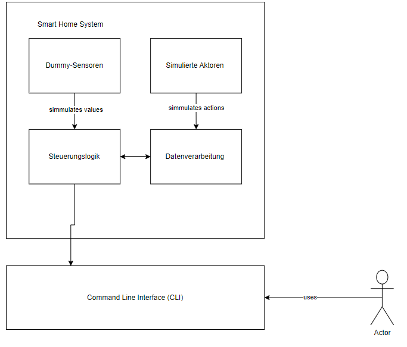
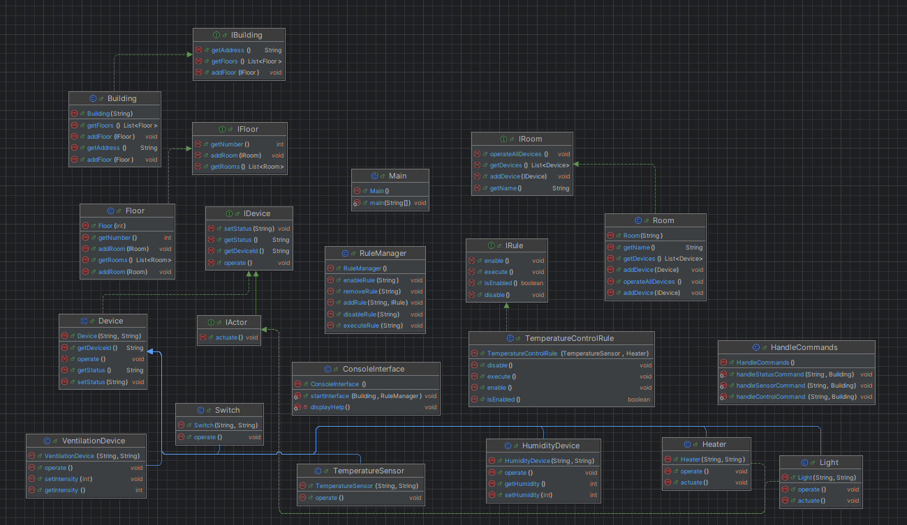

# Smart Home System
### Autor:
* Torben Voigt
## Inhaltsverzeichnis
-[Einleitung](#einleitung)

# Smart Home System
## Autor:
- Torben Voigt
# Inhaltsverzeichnis
- [Einleitung](#einleitung)
    - [Überblick über das Smart Home System](#überblick-über-das-smart-home-system)
    - [Zielsetzung dieser Dokumentation](#zielsetzung-dieser-dokumentation)
    - [Entstehungshintergrund des Smart Home Systems](#entstehungshintergrund-des-smart-home-systems)
    - [Definition der Systemgrenzen](#definition-der-systemgrenzen)
    - [Fachlicher Kontext](#fachlicher-kontext)
    - [Externe Kommunikationspartner](#externe-kommunikationspartner)
        - [Dummy-Sensoren und Aktoren](#dummy-sensoren-und-aktoren)
        - [Visualisierungsinterface](#visualisierungsinterface)
    - [Fachliche Schnittstellen](#fachliche-schnittstellen)
        - [Nutzereingabe](#nutzereingabe)
        - [Systemausgabe](#systemausgabe)
        - [Simulierte Steuerbefehle und Sensorabfragen](#simulierte-steuerbefehle-und-sensorabfragen)
    - [Technischer Kontext](#technischer-kontext)
    - [Technische Schnittstellen](#technische-schnittstellen)
        - [Terminal](#terminal)
- [Anforderungsanalyse](#anforderungsanalyse)
    - [Funktionale Anforderungen](#funktionale-anforderungen)
    - [Nicht-funktionale Anforderungen](#nicht-funktionale-anforderungen)
    - [Benutzerrollen und Interaktionen](#benutzerrollen-und-interaktionen)
- [Design und Konzeption](#design-und-konzeption)
    - [Bausteinsicht](#bausteinsicht)
    - [UML-Diagramm](#uml-diagramm)
    - [Technologische Wahl](#technologische-wahl)
- [Dokumentation](#dokumentation)
    - [Aktoren & Sensoren](#aktoren--sensoren)
    - [Regelsysteme](#regelsysteme)
    - [Command Line Interface](#command-line-interface)
- [Installationsanleitung](#installationsanleitung)
- [Weitere Schritte](#weitere-schritte)
## Einleitung
### Überblick über das Smart Home System
Dieses Dokument dient als umfassender Leitfaden für das im Rahmen meines Studiums entwickelte Smart Home System an der FHDW. Es zielt darauf ab, eine detaillierte Einsicht in die Struktur und Funktionalität des Systems zu bieten, sowie die technologischen Entscheidungen, die zur Realisierung des Projekts getroffen wurden, zu erläutern.

### Zielsetzung dieser Dokumentation
Der Hauptzweck dieses Dokuments ist es, eine klare und präzise Darstellung der Architektur des Smart Home Systems zu liefern. Es wird beschrieben, wie die einzelnen Komponenten und Module interagieren, um eine anpassungsfähige und erweiterbare Plattform für die Gebäudesteuerung zu schaffen. Weiterhin erörtere ich die Verbindungspunkte zwischen den Systemmodulen sowie die Einbindung und Erweiterungsmöglichkeiten, die das System bietet.

### Entstehungshintergrund des Smart Home Systems
Das System wurde entwickelt, um innovative Technologien in der Gebäudeautomation praktisch anzuwenden und das Lehrangebot mit realen, technischen Herausforderungen zu bereichern. Als einzelner studentischer Entwickler war es meine Aufgabe, einen funktionierenden Prototyp eines umfassenden Smart Home Systems zu erstellen, das als Basis für die Automatisierung verschiedener Gebäudefunktionen dient und die Integration zusätzlicher Komponenten erleichtert.

Die Hauptmerkmale des Systems umfassen die Bereitstellung einer Betriebsumgebung für die Gebäudeautomatisierung, die einfache Einführung neuer Sensoren und Aktoren und die effiziente Verknüpfung mit externen Systemen.

### Definition der Systemgrenzen
Innerhalb dieser Dokumentation werden die Schnittstellen und Interaktionspartner des Smart Home Systems klar abgegrenzt. Dies bezieht sich auf die Verbindungen zu Sensoren und Aktoren sowie auf die Nutzerschnittstellen durch das Command Line Interface. Diese Grenzen sind so gesetzt, dass sie die Flexibilität des Systems erhalten und gleichzeitig eine einfache Skalierbarkeit und Anpassungsfähigkeit ermöglichen.

### Fachlicher Kontext
Der fachliche Kontext des Smart Home Systems beinhaltet die Interaktionen innerhalb des Systems, das ausschließlich mit simulierten Daten und internen Steuerungslogiken arbeitet.

### Externe Kommunikationspartner
Das System nutzt keine realen externen Geräte oder Sensoren. Stattdessen verwendet es simulierte Schnittstellen, die wie folgt funktionieren:

#### Dummy-Sensoren und Aktoren
Das System generiert selbst Daten von simulierten Sensoren wie Temperaturfühlern, Lichtsensoren und Bewegungsdetektoren. Diese Daten werden verwendet, um Steuerbefehle an simulierte Aktoren wie Heizungen, Lichter und Türschlösser zu senden.
#### Visualisierungsinterface
Alle Interaktionen mit dem Nutzer erfolgen über ein einfaches Command Line Interface, das den simulierten Zustand des Systems visualisiert und Nutzerbefehle für Testszenarien entgegennimmt.

### Fachliche Schnittstellen
Die fachlichen Schnittstellen des simulierten Systems umfassen:

#### Nutzereingabe
Über das Terminal können Nutzer Befehle eingeben, die normalerweise die Aktoren steuern oder Informationen über die Zustände der Sensoren liefern würden.
#### Systemausgabe
Simulierte Antworten und Zustände des Systems werden textbasiert über das Terminal ausgegeben.
#### Simulierte Steuerbefehle und Sensorabfragen
Das System verwendet ein internes Regelwerk, um basierend auf simulierten Sensorwerten automatisierte Aktionen zu steuern oder auf Nutzereingaben zu reagieren.

### Technischer Kontext
Der technische Kontext beschreibt die internen technischen Verbindungen und Schnittstellen des Systems, die ausschließlich mit simulierten Daten arbeiten.

### Technische Schnittstellen
Die technischen Schnittstellen des Smart Home Systems umfassen:

#### Terminal
Das Terminal dient als primäre Schnittstelle für den Endnutzer, um mit dem simulierten System zu interagieren.
#### Interne Logikverbindungen
Das System interagiert intern mit simulierten Netzwerkverbindungen, die es ermöglichen, Daten zwischen den simulierten Sensoren und Aktoren auszutauschen.
#### Datenverarbeitungslogik
Die Entscheidungsfindung basiert auf einer Reihe von definierten Regeln, die simulieren, wie das System auf Änderungen in den simulierten Sensorwerten reagieren würde.

### Kontextdiagramm

Das Kontextdiagramm visualisiert die Interaktionen und Datenflüsse innerhalb des Smart Home Systems, das ausschließlich mit simulierten Komponenten arbeitet. Folgende Hauptkomponenten und ihre Verbindungen sind dargestellt:

#### Mensch (Nutzer)
**Position:** Links neben der CLI (Command Line Interface).
**Beschreibung:** Der Nutzer repräsentiert die Person, die Interaktionen mit dem System über die CLI durchführt. Diese Darstellung symbolisiert die Schnittstelle, über welche Nutzereingaben erfolgen und Informationen vom System empfangen werden.
#### Command Line Interface (CLI)
**Position:** Zentral im unteren Bereich des Diagramms, direkt verbunden mit dem Menschen (Nutzer) und der internen Steuerungslogik.
**Beschreibung:** Das CLI ist die primäre Benutzerschnittstelle, über die der Nutzer Befehle eingibt und Rückmeldungen vom System erhält. Es dient als Vermittler zwischen dem Menschen und der Steuerungslogik des Smart Home Systems.
#### Smart Home System
**Position:** Umfasst die zentrale und obere Bereiche des Diagramms.
**Beschreibung:** Innerhalb dieser Systemgrenze befinden sich die simulierten Sensoren, Aktoren, die Steuerungslogik und die Datenverarbeitung. Das gesamte System interagiert intern, um eine simulierte Gebäudeautomation zu realisieren.
#### Dummy-Sensoren
**Position:** Innerhalb der Systemgrenze, meist im oberen Bereich.
**Beschreibung:** Diese Komponenten simulieren verschiedene Arten von Sensordaten (wie Temperatur, Licht, Bewegung), die zur Steuerungslogik gesendet werden.
#### Simulierte Aktoren
**Position:** Ebenfalls innerhalb der Systemgrenze, nahe den Sensoren.
**Beschreibung:** Aktoren reagieren auf Befehle von der Steuerungslogik, um simulierte Aktionen wie Lichtsteuerung oder Temperaturanpassungen durchzuführen.
#### Steuerungslogik
**Position:** Im Zentrum der Systemgrenze, direkt verbunden mit Sensoren, Aktoren und dem CLI.
**Beschreibung:** Diese Kernkomponente verarbeitet alle Eingaben von Sensoren und der CLI, trifft Entscheidungen und sendet entsprechende Befehle an die Aktoren. Sie ist das Gehirn des Systems.
#### Datenverarbeitung
**Position:** In der Nähe der Steuerungslogik innerhalb der Systemgrenze.
**Beschreibung:** Diese Komponente handhabt interne Datenoperationen, speichert Testergebnisse und Verlaufsinformationen, die für Testszenarien innerhalb des simulierten Systems benötigt werden.

## Anforderungsanalyse
### Funktionale Anforderungen
Das Smart Home System, das für die FHDW entwickelt wird, zielt darauf ab, eine Plattform für Lehr- und Forschungszwecke zu bieten. Daher muss das System folgende funktionale Anforderungen erfüllen:

#### Aktoren und Sensoren Integration
Das System muss verschiedene Aktoren und Sensoren integrieren können. Beispiele für Aktoren sind Lichtschalter, Relais, Lüftungsregler, Heizungen, Rolladenmotoren und Türschlösser. Sensoren sollten in der Lage sein, verschiedene Umgebungsparameter wie Temperatur, Lichtstärke, Luftfeuchtigkeit, Anwesenheit von Personen und RFID-Tags zu erfassen.
#### Visualisierung
Eine grundlegende Visualisierungskomponente muss implementiert werden, die über ein Command Line Interface (CLI) bedienbar ist. Diese Komponente sollte die Möglichkeit bieten, eine Liste von Gebäuden, Etagen und Räumen anzuzeigen sowie aktuelle Sensorwerte pro Raum oder Sensortyp darzustellen.
#### Manuelle Ansteuerung von Aktoren
Benutzer sollten in der Lage sein, Aktoren manuell zu steuern, sowohl auf der Ebene einzelner Räume als auch gebäude- oder etagenweit.
#### Regelsystem
Es sollte möglich sein, Regeln zu definieren, die auf Klassen oder Interfaces basieren. Diese Regeln können entweder durch Sensorereignisse, zu festgelegten Zeiten oder manuell getriggert werden.
#### Einfache Erweiterbarkeit
Die Softwarearchitektur muss so gestaltet sein, dass sie einfach um neue Sensoren, Aktoren und Regeln erweitert werden kann.
### Nicht-funktionale Anforderungen
Neben den funktionalen Anforderungen muss das Smart Home System auch folgende nicht-funktionale Anforderungen erfüllen:

#### Skalierbarkeit
Das System muss in der Lage sein, mehrere Gebäude zu unterstützen und leicht skalierbar sein, um zusätzliche Gebäude, Etagen und Räume hinzufügen zu können.
#### Benutzerfreundlichkeit
Die Bedienung des Systems, insbesondere das CLI, muss intuitiv und benutzerfreundlich sein, um eine effiziente Nutzung und Forschung zu ermöglichen.
#### Zuverlässigkeit und Stabilität
Das System muss stabil und zuverlässig laufen, insbesondere da es für Bildungs- und Forschungszwecke eingesetzt wird.
#### Wartbarkeit
Die Wartung des Systems sollte durch klare Dokumentation und eine modular aufgebaute Architektur vereinfacht werden

### Benutzerrollen und Interaktionen
Im Rahmen des Entwurfs für das Smart Home System an der FHDW wird kein Unterschied zwischen verschiedenen Benutzertypen gemacht. Das System ist so konzipiert, dass es keine spezifischen Rollen mit unterschiedlichen Anforderungen oder Berechtigungen gibt. Jeder Benutzer des Systems hat Zugriff auf die gleichen Funktionen und Möglichkeiten:

#### Einheitliche Benutzerinteraktion
Alle Benutzer des Systems interagieren über das gleiche Command Line Interface (CLI) und haben Zugriff auf alle Funktionen des Systems. Dies umfasst die Anzeige von Gebäuden, Etagen und Räumen, das Abrufen aktueller Sensorwerte und die manuelle Ansteuerung von Aktoren.
#### Gleiche Zugriffsrechte
Es gibt keine differenzierten Zugriffsrechte oder unterschiedliche Benutzerebenen. Jeder Benutzer kann das System vollumfänglich nutzen, was die Bedienung vereinfacht und die Einarbeitungszeit minimiert.
#### Homogene Nutzungserfahrung
Die Entscheidung, keine unterschiedlichen Benutzerrollen zu implementieren, zielt darauf ab, eine homogene Nutzungserfahrung für alle Anwender zu schaffen. Dies ist besonders vorteilhaft in einem akademischen Umfeld, wo Flexibilität und einfacher Zugang zu Lehr- und Forschungstools gewünscht sind.

## Design und Konzeption
   Das Design und die Konzeption des Smart Home Systems an der FHDW basieren auf einer durchdachten und skalierbaren Softwarearchitektur, die darauf abzielt, eine flexible Plattform für Lehr- und Forschungszwecke zu bieten. Dieser Abschnitt der Dokumentation beschreibt die zentralen Designentscheidungen, die Bausteinsicht und das UML-Diagramm, das die Systemarchitektur visualisiert.

### Bausteinsicht
Die Bausteinsicht des Smart Home Systems visualisiert die wichtigsten Softwarekomponenten und ihre Beziehungen zueinander. Hier wird die Hierarchie und Kommunikation zwischen verschiedenen Elementen des Systems dargestellt, die in der Systemarchitektur definiert sind.

#### Hauptkomponenten und ihre Funktionen
**IBuilding, IFloor, IRoom:** Diese Schnittstellen definieren die grundlegenden Eigenschaften und Methoden für Gebäude, Etagen und Räume. Sie ermöglichen eine abstrakte Interaktion mit den physischen Strukturen innerhalb des Systems.

**Building, Floor, Room:** Konkrete Implementierungen der IBuilding, IFloor und IRoom Schnittstellen. Diese Klassen sind verantwortlich für die Verwaltung der spezifischen Daten und Verhaltensweisen ihrer jeweiligen physischen Gegenstücke.

**IDevice, IActor:** Schnittstellen, die das Verhalten von Geräten und Aktoren im System definieren. IDevice bietet eine generelle Abstraktion für Geräte, während IActor speziell für Aktoren wie Lichtschalter oder Heizungen verwendet wird.

**Device, Actor:** Konkrete Implementierungen der IDevice und IActor Schnittstellen. Device dient als Basis für spezifischere Geräte, während Actor spezifische Funktionen für die Steuerung und Verwaltung von Aktoren bereitstellt.
**RuleManager:** Eine zentrale Komponente, die für das Management der Regeln im System zuständig ist. Sie koordiniert die Ausführung von Regeln basierend auf den von Sensoren gelieferten Daten oder anderen Ereignissen.
**IRule:** Eine Schnittstelle, die das erforderliche Verhalten für Regeln im System definiert. Regeln können auf Basis von Sensorwerten, zeitlichen Bedingungen oder manuellen Auslösern aktiviert werden.
**TemperatureControlRule**: Eine konkrete Implementierung der IRule-Schnittstelle, speziell entwickelt zur Temperaturkontrolle innerhalb des Systems. Diese Regel nutzt Daten von Temperatursensoren zur Steuerung von Heizungen oder Klimaanlagen.
**ConsoleInterface:** Die Benutzerschnittstelle des Systems, implementiert als Command Line Interface. Diese Komponente ermöglicht die direkte Interaktion mit dem System durch Befehlseingaben, um Gebäude, Etagen oder Räume zu verwalten und Geräte zu steuern.
**HandleCommands:** Eine Hilfsklasse, die für das Verarbeiten von Benutzerbefehlen über das ConsoleInterface verantwortlich ist. Sie interpretiert die Eingaben und leitet entsprechende Aktionen ein.

#### Spezifische Geräteklassen
Switch, VentilationDevice, TemperatureSensor, HumidityDevice, Light, Heater: Diese Klassen sind spezialisierte Implementierungen von Device oder Actor, die jeweils spezifische Funktionen in Bezug auf ihre Aufgabe im System erfüllen. Beispielsweise kann ein Switch das Ein- und Ausschalten von Licht regeln, während ein TemperatureSensor Temperaturdaten liefert.
Diese Bausteinsicht bietet einen umfassenden Überblick über die Architektur und die einzelnen Komponenten des Smart Home Systems, die für die Erfüllung der spezifischen Anforderungen des Projekts essentiell sind. Sie verdeutlicht, wie die Komponenten miteinander interagieren und zusammenarbeiten, um eine flexible und erweiterbare Plattform für das Smart Home zu schaffen.

Modularität und Wiederverwendbarkeit: Die Verwendung von Schnittstellen wie IBuilding, IFloor, IRoom, IDevice und IActor fördert die Wiederverwendbarkeit von Code und erleichtert die Erweiterung des Systems. Neue Gerätetypen oder Aktoren können durch das Implementieren der entsprechenden Schnittstellen leicht hinzugefügt werden.
Zentrale Verwaltung durch RuleManager: Der RuleManager spielt eine zentrale Rolle im System, indem er die Regeln verwaltet und deren Ausführung steuert. Diese zentrale Steuerung ermöglicht es, dass Regeln systemweit konsistent und effizient angewendet werden.
Interaktion durch ConsoleInterface: Das ConsoleInterface ermöglicht eine direkte und einfache Interaktion mit dem System, was besonders nützlich ist, um das System für Lehr- und Forschungszwecke anzupassen und zu steuern.
Diese Architektur bietet eine klare Trennung der Verantwortlichkeiten und fördert eine hohe Kohäsion innerhalb der Komponenten, was die Wartung und Erweiterung des Systems erleichtert.

### UML-Diagramm

Das UML-Diagramm gibt einen detaillierten Überblick über die Klassenstruktur und Beziehungen innerhalb des Smart Home Systems. Es illustriert die Objektorientierung und das Design des Systems und zeigt die Verbindungen zwischen Schnittstellen und Implementierungen auf. Hier eine Beschreibung des UML-Diagramms:

#### Hauptkomponenten und Klassen
* IBuilding, IFloor, IRoom: Diese Interfaces definieren die Methoden, die von den entsprechenden Klassen Building, Floor und Room implementiert werden. Sie ermöglichen grundlegende Operationen wie das Hinzufügen oder Abrufen von Etagen und Räumen sowie das Setzen und Abrufen von Eigenschaften wie Gebäudenummer oder Raumname.
* Building, Floor, Room: Diese Klassen sind die konkreten Implementierungen der zuvor genannten Schnittstellen und bieten Funktionalitäten zur Verwaltung der physischen Strukturen des Gebäudes. Building verwaltet mehrere Floors, während Floor mehrere Rooms verwaltet, was die hierarchische Struktur des Gebäudemanagements widerspiegelt.
* Device, Actor, Switch, VentilationDevice, TemperatureSensor, HumidityDevice, Heater, Light: Diese Klassen repräsentieren die Geräte und Aktoren im System. Device ist die Basisklasse für alle Geräte, während Actor eine spezifische Klasse für Aktoren darstellt, die Aktionen ausführen können, wie z.B. das Aktivieren oder Deaktivieren von Geräten. Spezialisierte Geräte wie Switch, Heater, oder Light haben spezifische Funktionen, die ihre jeweilige Rolle im System definieren.
* RuleManager und Rule: RuleManager ist zuständig für die Verwaltung und Ausführung von Regeln innerhalb des Systems. Rule ist ein Interface, das von spezifischen Regelklassen wie TemperatureControlRule implementiert wird. Diese Klassen definieren spezifische Regeln, die basierend auf Sensordaten oder anderen Bedingungen aktiviert werden können.
* ConsoleInterface und HandleCommands: ConsoleInterface ist die Klasse, die für die Interaktion des Benutzers mit dem System über ein Kommandozeileninterface verantwortlich ist. HandleCommands verarbeitet die über das Interface eingegebenen Befehle und führt entsprechende Aktionen aus, wie z.B. das Steuern von Geräten oder das Anzeigen von Systeminformationen.

#### Beziehungen zwischen den Klassen
* Vererbung und Implementierung: Die Verwendung von Interfaces wie IBuilding und IDevice ermöglicht es, dass verschiedene Klassen wie Building oder Device bestimmte Methoden implementieren müssen, was eine konsistente Nutzung dieser Objekte im System gewährleistet.
* Aggregation und Komposition: Die Beziehungen zwischen Building, Floor und Room sind Beispiele für Aggregation, da ein Building mehrere Floors enthält, aber ohne diese weiter existieren kann. Die Verwendung von Komposition wäre bei der Verwaltung von Devices innerhalb eines Rooms zu sehen, wo das Löschen eines Rooms auch die darin enthaltenen Devices betrifft.
* Assoziation: Klassen wie RuleManager und die verschiedenen Rule-Implementierungen zeigen Assoziationsbeziehungen, die anzeigen, wie Regeln im System verwaltet und ausgeführt werden.
* Dieses UML-Diagramm ist zentral für das Verständnis der Funktionsweise und der strukturellen Organisation des Smart Home Systems, da es nicht nur die Einzelteile, sondern auch deren Interaktionen verdeutlicht.

### Technologische Wahl
Die Wahl der Technologie für das Smart Home System basiert auf Java, einer robusten und weit verbreiteten Programmiersprache, die sich ideal für die Entwicklung komplexer Softwaresysteme eignet. Java wurde aufgrund seiner starken Objektorientierung, der guten Unterstützung durch Entwicklungswerkzeuge und der umfangreichen Community gewählt. Diese Eigenschaften sind besonders wichtig für ein akademisches Umfeld, in dem Zuverlässigkeit, Wartbarkeit und die Möglichkeit zur Zusammenarbeit im Vordergrund stehen.

### Vorteile von Java
* **Plattformunabhängigkeit:** Java-Programme sind plattformunabhängig, was bedeutet, dass das Smart Home System auf verschiedenen Hardware- und Betriebssystemkonfigurationen ohne Modifikation ausgeführt werden kann. Dies ist besonders nützlich für ein System, das potenziell auf unterschiedliche physische Standorte erweitert werden könnte.
* **Gemeinschaft und Ressourcen:** Es gibt eine große Entwicklergemeinschaft und eine Fülle von Ressourcen für Java-Entwickler, was die Problembehebung und den Austausch von Best Practices erleichtert.
* **Sicherheit und Zuverlässigkeit:** Java ist bekannt für seine Sicherheitsfeatures und seine robuste Laufzeitumgebung, was es zu einer sicheren Wahl für das Backend eines Smart Home Systems macht.
* 
Für die Entwicklung wurde eine IDE IntelliJ IDEA verwendet, die speziell auf Java zugeschnitten ist und Entwicklern leistungsstarke Werkzeuge für die Codeverwaltung, das Debugging und das Testen bieten.

Zusammenfassend ermöglicht Java die Entwicklung eines stabilen und skalierbaren Smart Home Systems, das die Anforderungen an ein modernes, erweiterbares und lehrreiches Forschungstool erfüllt. Die Entscheidung für Java trägt dazu bei, dass das System nicht nur funktional, sondern auch zukunftssicher und anpassungsfähig ist.

## Dokumentation

### Aktoren & Sensoren

#### Allgemeine Architektur
Alle Aktoren und Sensoren im System basieren auf einem gemeinsamen Device Interface, das grundlegende Methoden zur Interaktion und zum Betrieb der Geräte definiert. Dieses Interface gewährleistet, dass alle Geräte im System auf eine konsistente Weise gesteuert und abgefragt werden können, unabhängig von ihrer spezifischen Funktion oder Technologie.

Device Interface:

operate(): Führt eine spezifische Operation des Geräts aus, wie z.B. das Einschalten eines Lichts oder das Messen der Temperatur.
getStatus(): Liefert den aktuellen Status des Geräts zurück.
setStatus(String status): Setzt den Status des Geräts basierend auf dem übergebenen Wert.
Um die Implementierung und Wartung zu vereinfachen, erweitern spezifische Aktoren und Sensoren eine abstrakte Klasse AbstractDevice, die das Device Interface implementiert. Diese Klasse bietet eine grundlegende Implementierung der Interface-Methoden und kann von konkreten Geräteklassen nach Bedarf erweitert und angepasst werden.

#### Aktoren
Aktoren sind Geräte, die physische Aktionen ausführen, um auf Änderungen im System oder Benutzeranweisungen zu reagieren. Einige Beispiele für Aktoren im System umfassen:

* Licht: Steuert das Ein- und Ausschalten von Beleuchtungseinrichtungen.
* Heizung: Reguliert die Temperatur durch Einstellen der Heizungsstufen.
* Rolladenmotor: Kontrolliert die Position von Jalousien oder Rolläden zur Licht- und Wärmeregulierung.
* Türschloss: Öffnet oder schließt physische Sicherheitsschlösser.

Jeder Aktor implementiert zusätzliche spezifische Methoden für seine Funktionen, wie z.B. adjustTemperature(int degree) für Heizungen oder toggleLight(boolean on) für Lichtsysteme.

#### Sensoren
Sensoren dienen dazu, Informationen über die Umgebung oder den Zustand des Systems zu sammeln. Sie liefern Daten, die für die Entscheidungsfindung innerhalb des Regelsystems verwendet werden können. Beispiele für Sensoren im System sind:

* Temperatursensor: Misst die Umgebungstemperatur und gibt diese in Celsius zurück.
* Feuchtigkeitssensor: Erfasst den Feuchtigkeitsgehalt der Luft.
* Lichtsensor: Misst die Lichtintensität in einem Raum.
* Anwesenheitssensor: Detektiert die Anwesenheit von Personen in einem Bereich.

Diese Sensoren verwenden das Device Interface, um ihre Messwerte zugänglich zu machen, und können spezifische Methoden wie readTemperature() oder detectPresence() beinhalten.

#### Integration und Nutzung
Die Aktoren und Sensoren sind so konzipiert, dass sie leicht in das Smart Home System integriert werden können. Durch die Definition in der Konfigurationsdatei sind Geräte bestimmten Räumen oder Bereichen zugeordnet. Das System kann die Geräte über das Command Line Interface steuern oder automatisch über das Regelsystem basierend auf den von den Sensoren gelieferten Daten reagieren.

### Gebäuden, Etagen und Räumen

Das Smart Home System ist strukturiert in einer hierarchischen Architektur bestehend aus Gebäuden (Buildings), Etagen (Floors) und Räumen (Rooms), wobei diese Struktur eine flexible und erweiterbare Handhabung der verschiedenen Bereiche und deren spezifischen Anforderungen ermöglicht.

#### Interface und Implementierung
Jeder dieser Bereiche ist durch ein spezifisches Interface definiert – IBuilding, IFloor, und IRoom. Diese Interfaces stellen sicher, dass alle implementierenden Klassen die notwendigen Methoden bereitstellen, um die Funktionalität des Systems einheitlich zu unterstützen und bei Bedarf erweitert werden können.

* IBuilding Interface:
Methoden um Etagen hinzuzufügen oder abzufragen.

* IFloor Interface:
Methoden zur Verwaltung der Räume innerhalb der Etage.
* IRoom Interface:
Methoden zur Verwaltung und Interaktion mit den spezifischen Sensoren und Aktoren eines Raumes.

#### Klassenstruktur
* Building: Implementiert das IBuilding Interface und verwaltet eine Liste von Etagen. Jedes Gebäude kann mehrere Etagen haben, die jeweils spezifische Räumlichkeiten und Funktionen repräsentieren. Die Klasse bietet Methoden, um Etagen hinzuzufügen, zu entfernen oder spezifische Etagen abzufragen.
* Floor: Implementiert das IFloor Interface und hält eine Liste von Räumen. Eine Etage dient als organisatorische Einheit innerhalb eines Gebäudes und beherbergt verschiedene Räume, die jeweils unterschiedliche Funktionen und Geräte haben können.
* Room: Implementiert das IRoom Interface und ist zuständig für die Verwaltung der in ihm befindlichen Sensoren und Aktoren. Jeder Raum im System ist mit spezifischen Sensoren und Aktoren ausgestattet, die durch das Smart Home System kontrolliert und überwacht werden können.
* Funktionalität und Hierarchie

Diese hierarchische Anordnung erlaubt eine strukturierte Verwaltung und einfache Navigation innerhalb des Systems. Durch die Implementierung von Interfaces und abstrakten Klassen ist das System bereit für Erweiterungen, wie zum Beispiel die Hinzufügung neuer Gebäudetypen oder Raumfunktionen, ohne die bestehende Systemlogik grundlegend zu ändern.

Zuweisung von Geräten: In der Konfigurationsdatei werden Räumen spezifische Sensoren und Aktoren zugewiesen. Diese Zuordnung ermöglicht es dem System, die Geräte effektiv zu verwalten und den Benutzern die Kontrolle über spezifische Funktionen zu geben.
Visualisierung und Kontrolle: Benutzer können über das Command Line Interface auf eine Liste der Gebäude, deren Etagen und die darin enthaltenen Räume zugreifen. Sie können die aktuellen Werte der Sensoren abfragen oder Aktoren je nach Bedarf steuern. Diese Funktionalität ist besonders nützlich für Lehr- und Forschungszwecke, da sie eine detaillierte Steuerung und Überwachung der Umgebung ermöglicht.

### Regelsysteme
#### Konzept und Implementierung
Das Regelsystem basiert auf einer flexiblen Architektur, die es erlaubt, Regeln als Klassen innerhalb des Systems zu definieren. Diese Klassen implementieren das IRule Interface, welches grundlegende Methoden zur Aktivierung, Deaktivierung und Ausführung von Regeln vorschreibt.

IRule Interface:

* enable(): Aktiviert die Regel, sodass sie bei entsprechenden Bedingungen ausgeführt wird.
* disable(): Deaktiviert die Regel, sodass keine Ausführung stattfindet.
* execute(): Führt die Aktionen der Regel aus, basierend auf den definierten Bedingungen.

Die Regeln werden durch den RuleManager verwaltet, einer zentralen Komponente, die für das Laden, Verwalten und Ausführen aller im System definierten Regeln zuständig ist. Der RuleManager sorgt dafür, dass die Regeln ordnungsgemäß aktiviert und basierend auf den Eingaben von Sensoren oder anderen Ereignissen ausgeführt werden.

Beispiele für Regelimplementierungen
Die Regeln können auf eine Vielzahl von Bedingungen reagieren, einschließlich Sensorwerten, Zeitplänen oder manuellen Auslösern. Hier einige Beispiele für typische Regeln im System:

* TemperaturControlRule: Diese Regel könnte automatisch die Heizung in einem Raum ein- oder ausschalten, basierend auf der gemessenen Temperatur und einem vordefinierten Temperaturziel.
* LightControlRule: Eine Regel, die Beleuchtung in Abhängigkeit von der Tageszeit oder der Anwesenheit von Personen steuert.
* SecurityRule: Eine Sicherheitsregel, die Türen automatisch verriegelt, wenn keine Personen im Gebäude erkannt werden.

Jede Regel verwendet Sensordaten und Steuerelemente für Aktoren, um spezifische Aktionen durchzuführen, die zur Effizienz und zum Komfort im Gebäude beitragen.

#### Flexibilität und Erweiterbarkeit
Die Architektur des Regelsystems ist darauf ausgelegt, einfach erweitert zu werden. Neue Regeln können durch das Hinzufügen neuer Klassen, die das IRule Interface implementieren, ins System eingeführt werden. Diese Flexibilität erleichtert die Anpassung des Systems an sich ändernde Anforderungen oder neue technologische Möglichkeiten, ohne dass umfangreiche Änderungen an der bestehenden Systemlogik notwendig sind.

Integration und Interaktion
Regeln können über das Command Line Interface aktiviert oder deaktiviert werden, was den Benutzern ermöglicht, die Automatisierung des Systems nach Bedarf zu konfigurieren. Diese Interaktion ist besonders wichtig, um das System an spezifische Szenarien oder Benutzerpräferenzen anzupassen.

### Command Line Interface
#### Hauptfunktionen des CLI
Das CLI unterstützt eine Vielzahl von Funktionen, die es den Nutzern ermöglichen, eine detaillierte Steuerung und Überwachung des Systems durchzuführen:

* Anzeige der Gebäudestruktur: Nutzer können sich eine Liste aller Gebäude und der darin enthaltenen Etagen und Räume anzeigen lassen. Diese Funktionalität ist besonders nützlich für die Navigation innerhalb des Systems und hilft Benutzern, den Überblick über die komplexe Struktur vieler Gebäude zu behalten.
* Sensorwerte abfragen: Das CLI ermöglicht es den Benutzern, aktuelle Werte der in den Räumen installierten Sensoren abzurufen. Diese Informationen können auf der Ebene einzelner Räume oder für bestimmte Sensortypen über alle Räume hinweg angezeigt werden, wie z.B. die Anzeige aller Temperaturwerte in einem bestimmten Gebäude oder einer Etage.
* Steuerung der Aktoren: Benutzer können über das CLI Aktoren manuell ansteuern, wie z.B. das Einschalten der Beleuchtung oder das Einstellen der Heizungstemperatur in spezifischen Räumen oder über ganze Etagen und Gebäude hinweg. Dies erlaubt eine flexible Reaktion auf veränderte Anforderungen oder Bedingungen innerhalb der Gebäude.
* Regeln aktivieren oder deaktivieren: Das System ermöglicht das Aktivieren oder manuelle Auslösen von Regeln über das CLI. Benutzer können spezifische Regeln aktivieren oder deaktivieren, was eine anpassbare Kontrolle über die automatisierten Funktionen des Systems bietet.
#### Technische Umsetzung
Das CLI ist als integraler Bestandteil des Systems konzipiert und eng mit der Systemlogik verknüpft. Die Implementierung erfolgt in Java, wobei das CLI auf robuste Klassen und Methoden zurückgreift, die eine sichere und effiziente Verarbeitung von Benutzereingaben gewährleisten. Die Befehlsverarbeitung ist so gestaltet, dass sie Fehler tolerant ist und Benutzern klare Rückmeldungen zu ihren Aktionen gibt.

* ConsoleInterface Klasse: Diese Klasse handhabt die gesamte Interaktion mit dem Benutzer über das Terminal. Sie nimmt Benutzereingaben entgegen und leitet die entsprechenden Aktionen ein, wie z.B. das Abrufen von Sensorwerten oder das Steuern von Aktoren.
* HandleCommands: Eine Hilfsklasse, die für das Parsen und Ausführen der durch das CLI erhaltenen Kommandos verantwortlich ist. Diese Klasse arbeitet eng mit dem RuleManager und anderen Systemkomponenten zusammen, um die korrekte Ausführung der Befehle zu gewährleisten.
Benutzerfreundlichkeit und Flexibilität

Das Design des CLI ist darauf ausgerichtet, eine benutzerfreundliche und intuitive Bedienung zu ermöglichen. Die Kommandos sind logisch strukturiert, und das System bietet Hilfe und Anleitungen zur Nutzung der verschiedenen Funktionen. Diese Zugänglichkeit macht das CLI zu einem wertvollen Werkzeug für alle Benutzer des Smart Home Systems, von den Systemadministratoren bis hin zu Forschern und Lehrenden, die das System für ihre Projekte nutzen.

## Installationsanleitung
Die folgende Installationsanleitung führt Sie durch die Einrichtung und Inbetriebnahme des Smart Home Systems. Dieser Leitfaden erläutert, wie Sie die erforderlichen Komponenten initialisieren und das System starten, um Benutzerinteraktionen über das Command Line Interface zu ermöglichen.

#### Vorbereitung der Installation
Stellen Sie sicher, dass Java auf Ihrem System installiert ist, da das Smart Home System in Java entwickelt wurde. Sie können die neueste Version von Java von der offiziellen Oracle Website herunterladen und installieren.

#### Schritte zur Installation
* Klonen des Repositorys:
Klonen Sie das Repository des Smart Home Systems von GitHub auf Ihren lokalen Computer. Dies können Sie tun, indem Sie den entsprechenden Git-Befehl im Terminal verwenden:
bash
Copy code
git clone https://github.com/TorbenVgt/Smart_Home

* Öffnen des Projekts:
Öffnen Sie das Projekt in Ihrer bevorzugten Java-Entwicklungsumgebung (IDE), wie IntelliJ IDEA oder Eclipse.
* Kompilieren des Projekts:
Kompilieren Sie das Projekt in Ihrer IDE oder verwenden Sie ein Build-Tool wie Maven oder Gradle, falls konfiguriert.
#### Initialisierung der Systemkomponenten
* Main-Datei:
Die Hauptklasse des Projekts, üblicherweise Main.java, enthält den Einstiegspunkt des Programms. In dieser Datei werden die Instanzen für verschiedene Komponenten des Systems initialisiert:
Gebäude und Flure: Instanzen für Gebäude und zugehörige Flure werden erstellt.
* Räume: Jeder Flur enthält mehrere Räume, die ebenfalls initialisiert werden.
* Sensoren und Aktoren: Jeder Raum wird mit den erforderlichen Sensoren und Aktoren ausgestattet, die zuvor in der Konfigurationsdatei definiert wurden.
* Regeln: Die Regeln, die das Verhalten der Sensoren und Aktoren steuern, werden initialisiert und dem RuleManager hinzugefügt.
#### Starten des CLI:
Nach der Initialisierung der Komponenten startet das System das Command Line Interface, über das Benutzer mit dem System interagieren können. Benutzer können Anfragen stellen, um den Status von Sensoren abzurufen, Aktoren zu steuern oder Regeln zu verwalten.
#### Benutzung des CLI
Sobald das CLI gestartet ist, können Benutzer verschiedene Befehle eingeben, um mit dem System zu interagieren. Eine Hilfe-Funktion (help) im CLI bietet Anleitungen zu verfügbaren Kommandos und deren Nutzung.
#### Programm beenden
Um das Smart Home System zu beenden, geben Sie einfach den Befehl exit in das CLI ein. Dieser Befehl beendet das Programm sicher und stellt sicher, dass alle Prozesse ordnungsgemäß geschlossen werden.

## Weitere Schritte